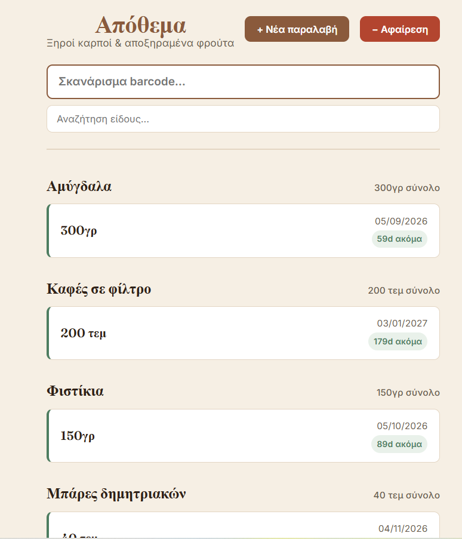

# Café Inventory System

**[🔴 Live demo](https://cafe-inventory.fastapicloud.dev)**



*Deployed on FastAPI Cloud, backend and frontend served from a single app via `app.frontend()`. This demo UI is in English for portfolio purposes; the original day-to-day version (for actual café staff) was in Greek — the UI strings were translated for this public demo.*

A barcode-based inventory system for a café/nut shop, built to solve a real problem: dried fruit and nuts have expiry dates, and every delivery batch expires on a different day. A single "current stock" number per product isn't enough — the system needs to know *which* batch is running out first.

## The core problem: FIFO with expiry-aware batches

Instead of tracking one stock number per product, each restock creates a new **batch** with its own expiry date. When a product is sold (scanned), stock is deducted from the earliest-expiring batch first — and if that batch doesn't have enough left, the remainder spills over into the next batch in expiry order.

```
Almonds:
  Batch A — 3.2kg remaining, expires 12/7
  Batch B — 10kg remaining, expires 28/7

Scan sells 500g → comes out of Batch A first (soonest to expire)
```

This also supports two tracking modes per product variety: **weight-based** (grams) for bulk items like nuts, and **unit-based** (pieces) for packaged items like coffee or cereal bars.

The dashboard polls `/varieties` and `/batches` on an interval, so stock levels stay current without needing a manual page refresh — useful since café staff will have it open on a screen throughout the day.

## Low-stock alerting

`scripts/low_stock.py` is a standalone, deterministic script (no LLM involved) that:
1. Sums how much of each variety was sold (OUT movements) in the last 7 days
2. Sums how much stock remains, per variety, across all active batches
3. Projects days-until-empty: `remaining × 7 / consumed`
4. Flags any variety projected to run out soon, and emails the owner

It's meant to run as a scheduled/cron job (not built into the live request path), since a café doesn't need second-by-second alerts — a daily heads-up is enough to reorder in time.

## Tech stack

- **Backend:** FastAPI + SQLAlchemy, PostgreSQL (Supabase)
- **Frontend:** React (Vite), served directly by FastAPI via `app.frontend()` — one deployment target instead of two
- **Deployment:** FastAPI Cloud
- **Scripts:** plain Python (SMTP email, no external services)

## Project structure

```
main.py              FastAPI app + endpoints (scan, restock, manual deduction) + frontend serving
models.py            SQLAlchemy models (Variety, Product, Batch, StockMovement)
schemas.py           Pydantic request/response schemas
database.py           DB session setup
create_tables.py     One-off script to create tables from the models
scripts/
  low_stock.py        Deterministic low-stock alert script (see above)
frontend/             Vite + React SPA (scan bar, restock modal, deduction modal)
```

## Running locally

```bash
# backend
python -m venv venv
venv\Scripts\activate        # Windows
pip install -r requirements.txt
python create_tables.py
uvicorn main:app --reload

# frontend
cd frontend
npm install
npm run dev
```

Requires a `.env` file (not committed) with `DATABASE_URL` and, for the alert script, `GMAIL_ADDRESS` / `GMAIL_PASSWORD`.

## Status

Core inventory tracking, manual deduction, and the low-stock script are complete and tested, running against a live Supabase (PostgreSQL) database. The app is deployed and live on FastAPI Cloud (link above). Next up: a consumption-pattern analysis feature (which days/periods see higher demand, for promo/restock timing — likely starting deterministic, with an LLM layer added only where it adds real value).