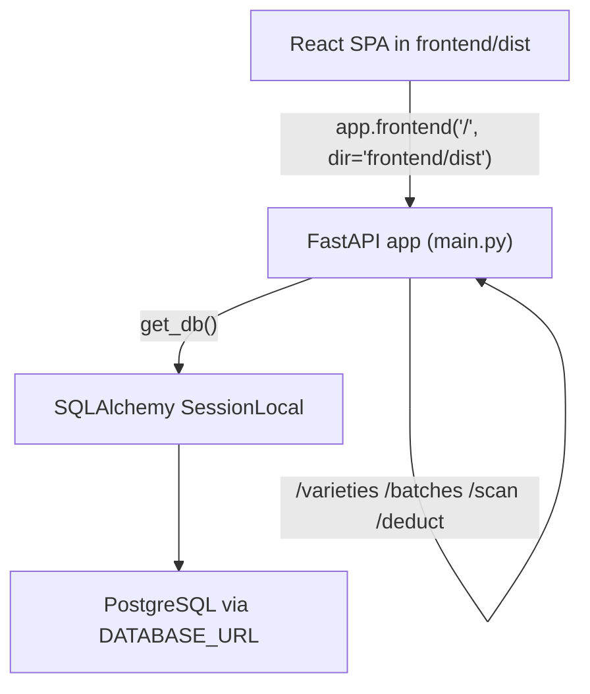
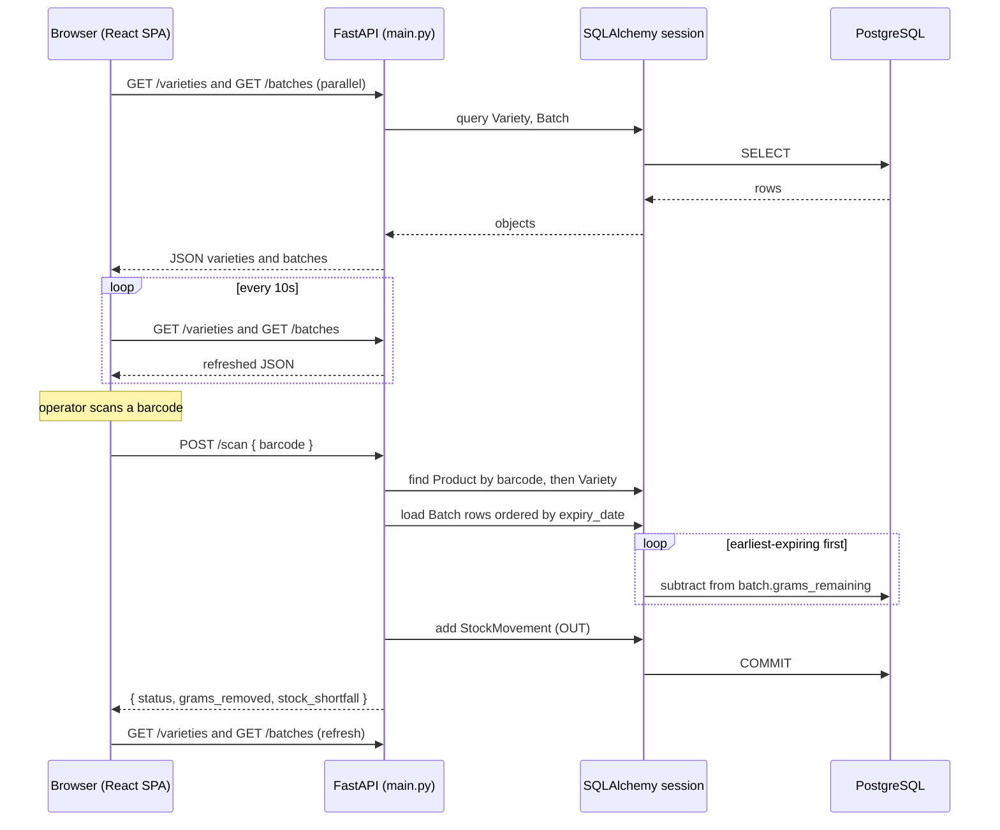

# Architecture Overview

## System shape

This is a **single-deployment full-stack app**: one FastAPI process serves both the JSON API and the built React frontend, so there is one deployment target rather than separate backend and frontend hosts.

- **Backend:** FastAPI application in `main.py`, using SQLAlchemy models (`models.py`) backed by PostgreSQL. The DB engine and session factory come from `database.py`, which reads `DATABASE_URL` from the environment.
- **Frontend:** React + Vite SPA under `frontend/`, built to `frontend/dist/`.
- **Serving model:** `main.py` mounts the built SPA with `app.frontend("/", directory="frontend/dist")`, so any non-API path is served by the same process that owns the API. The frontend's `API_BASE` is the empty string, so all `fetch` calls are same-origin relative paths resolved against the FastAPI app itself.
- **Deployment:** FastAPI Cloud, per the README.

The FastAPI process serves both the SPA and the API; the React client calls the API over same-origin relative paths.

## Request flow at runtime

1. The React dashboard loads and immediately fetches `/varieties` and `/batches` in parallel.
2. It re-runs that fetch on a 10-second interval, so an operator screen left open reflects fresh stock state without manual refresh.
3. A barcode scan POSTs `{ barcode }` to `/scan`; the backend resolves the barcode to a product/variety, deducts the earliest-expiring batch first, records a movement, and commits.
4. Restock and manual-removal actions POST to `/batches` and `/deduct` respectively; both also commit a movement on success.
5. Each successful mutation is followed by a `loadData()` refresh in the UI, so the dashboard re-fetches `/varieties` and `/batches` immediately after a change.

The dashboard load, 10s polling, scan POST, FIFO deduction, movement commit, and post-mutation refresh, grounded in the actual components.

## Backend responsibilities

`main.py` defines the API surface and the business rules that matter most:

- `GET /varieties` and `POST /varieties` — list and create tracked product varieties.
- `GET /products` and `POST /products` — list and create barcode-bound products that map a barcode to a variety (with optional `package_size_grams` for weight-tracked items).
- `GET /batches` and `POST /batches` — list and create stock batches with an expiry date; restock also records an `IN` movement and commits.
- `POST /scan` — resolves a barcode to a product/variety, then decrements the earliest-expiring batch first. For weight tracking it spills remaining demand across subsequent batches in expiry order; for unit tracking it decrements one from the earliest-expiring batch that still has units.
- `POST /deduct` — applies the same expiry-ordered FIFO logic for manual removal, supporting both weight and unit varieties.

`database.py` loads `DATABASE_URL` from the environment (via `dotenv`), builds the SQLAlchemy `engine` and `SessionLocal` session factory, and exposes the `get_db()` dependency that FastAPI endpoints use to obtain a session. The data model itself (`Variety`, `Product`, `Batch`, `StockMovement`) is described in [/openwiki/domain/concepts](/openwiki/domain/concepts.md); this page intentionally keeps that summary brief.

## The core constraint: expiry-aware FIFO

The architecture exists to enforce **expiry-aware FIFO consumption**, not general warehouse tracking. Each restock creates a distinct batch with its own `expiry_date`; when stock is sold or removed, the backend deducts from the batch that expires first and, for weight products, spills any remainder into the next batch in expiry order. This keeps operators from silently selling older inventory past its expiry. The frontend mirrors the same model: it filters batches by variety, sorts them by `expiry_date`, and derives urgency states (`expired`, `critical`, `soon`, `fresh`) from days-until-expiry.

## Serving and configuration invariants

A few configuration choices are load-bearing for the single-deployment shape:

- **Same-origin API:** the frontend sets `API_BASE = ""`, so every `fetch` is a relative path against the FastAPI origin. This only works because the backend also serves the SPA.
- **CORS is dev-only:** `CORSMiddleware` is configured with `allow_origins=["http://localhost:5173"]` — the Vite dev server origin only. In deployed (same-origin) serving the frontend does not need CORS; this middleware exists for local development where the SPA runs on port 5173 while the API runs on the FastAPI port.
- **Source upload excludes the build:** `.fastapicloudignore` contains `!frontend/dist`, so the built SPA is not uploaded as source; FastAPI Cloud builds it and the `app.frontend` mount serves the built output.
- **Movements are committed, not derived:** restock, scan, and manual deduction each `db.commit()` a `StockMovement` row, so consumption history is an authoritative audit trail rather than something reconstructed from current totals. This is what makes scheduled low-stock projection (in the separate `scripts/low_stock.py`) possible without re-deriving history.

## Extension and operational boundaries

- **Low-stock alerting is out of the request path.** `scripts/low_stock.py` is a standalone, deterministic script that sums `OUT` movements over a recent window and projects days-until-empty; it is intended to run as a cron/scheduled job, not inside FastAPI request handling. See [/openwiki/workflows/operations](/openwiki/workflows/operations.md).
- **Barcode mapping is the integration seam.** A `Product` ties a barcode to a `Variety` and an optional `package_size_grams`; `/scan` fails with 404 if the barcode is unknown and with 400 if a weight product lacks a package size. Source connectors and mapping details live in [/openwiki/integrations/source-map](/openwiki/integrations/source-map.md).
- **Table creation is explicit.** `create_tables.py` is a one-off script that creates the schema from the models; it is not invoked by the running app.
