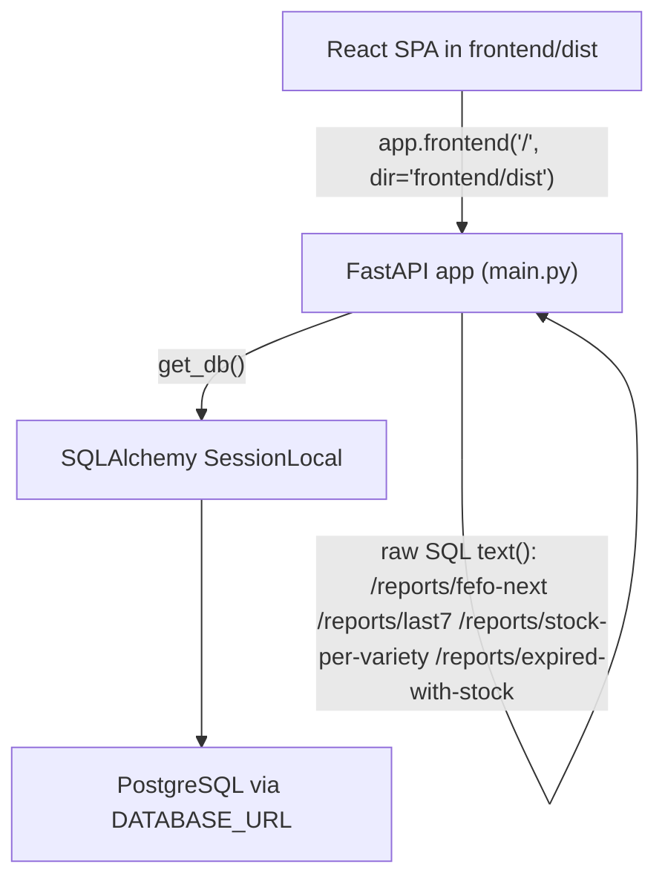
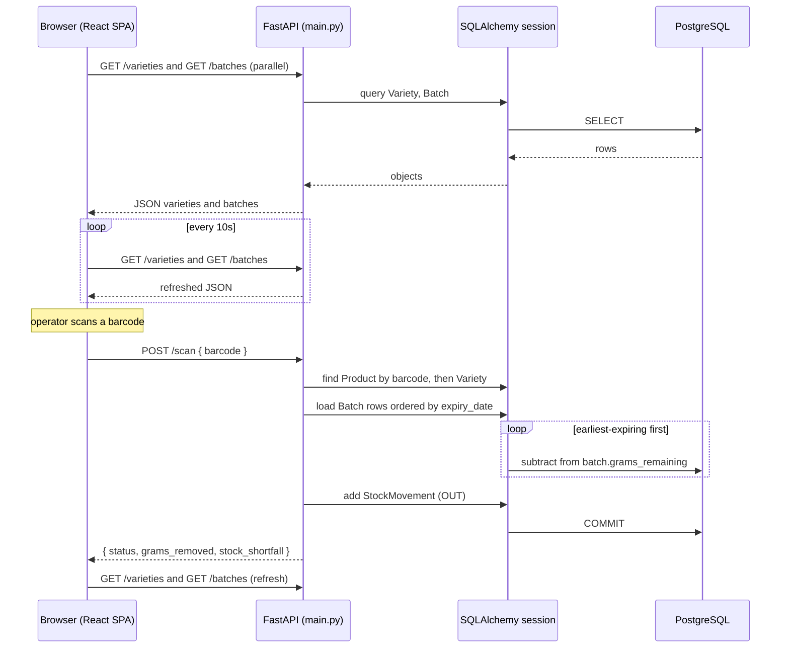
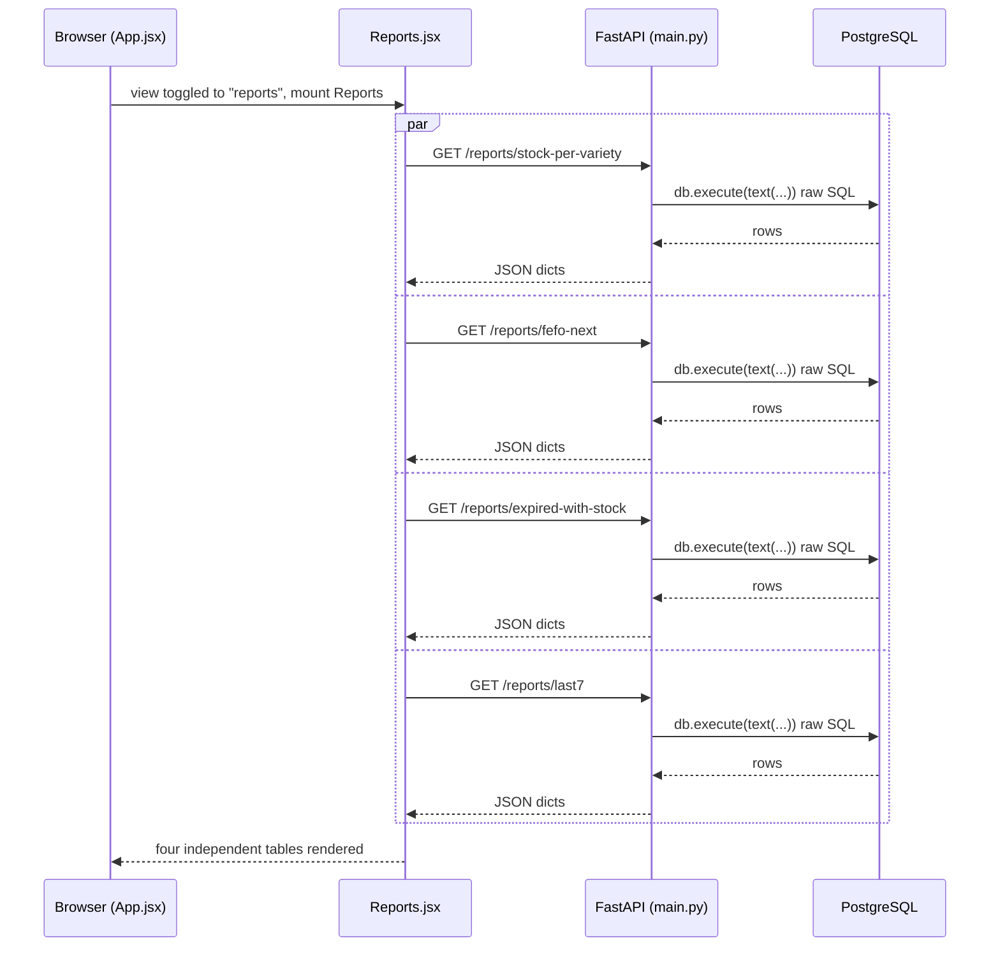

# Architecture Overview

## System shape

This is a **single-deployment full-stack app**: one FastAPI process serves both the JSON API and the built React frontend, so there is one deployment target rather than separate backend and frontend hosts.

- **Backend:** FastAPI application in `main.py`, using SQLAlchemy models (`models.py`) backed by PostgreSQL. The DB engine and session factory come from `database.py`, which reads `DATABASE_URL` from the environment.
- **Frontend:** React + Vite SPA under `frontend/`, built to `frontend/dist/`.
- **Serving model:** `main.py` mounts the built SPA with `app.frontend("/", directory="frontend/dist")`, so any non-API path is served by the same process that owns the API. The frontend's `API_BASE` is the empty string, so all `fetch` calls are same-origin relative paths resolved against the FastAPI app itself.
- **Deployment:** FastAPI Cloud, per the README.

The API surface splits into two styles. The stock-management endpoints (`/varieties`, `/products`, `/batches`, `/scan`, `/deduct`) use the SQLAlchemy ORM against the models and return Pydantic-serialized objects. The four report endpoints added later (`/reports/fefo-next`, `/reports/last7`, `/reports/stock-per-variety`, `/reports/expired-with-stock`) bypass the ORM entirely: each runs a raw SQL string through `db.execute(text(...)).mappings().all()` and returns plain dicts, with no `response_model` and no Pydantic validation.

```mermaid
flowchart TD
    A["React SPA in frontend/dist"] -->|"app.frontend('/', dir='frontend/dist')"| B["FastAPI app (main.py)"]
    B -->|"get_db()"| C["SQLAlchemy SessionLocal"]
    C --> D["PostgreSQL via DATABASE_URL"]
    B -->|"ORM: /varieties /products /batches /scan /deduct"| B
    B -->|"raw SQL text(): /reports/fefo-next /reports/last7 /reports/stock-per-variety /reports/expired-with-stock"| B
```

The FastAPI process serves both the SPA and the API; the React client calls the API over same-origin relative paths.

## Request flow at runtime

The React dashboard in `App.jsx` manages a top-level `view` state that is either `"stock"` (default) or `"reports"`. The header's Reports button toggles between them, and the `<main>` region renders either the stock dashboard (`VarietySection` list) or the `Reports` component.

### Stock view

1. The React dashboard loads and immediately fetches `/varieties` and `/batches` in parallel.
2. It re-runs that fetch on a 10-second interval, so an operator screen left open reflects fresh stock state without manual refresh.
3. A barcode scan POSTs `{ barcode }` to `/scan`; the backend resolves the barcode to a product/variety, deducts the earliest-expiring batch first, records a movement, and commits.
4. Restock and manual-removal actions POST to `/batches` and `/deduct` respectively; both also commit a movement on success.
5. Each successful mutation is followed by a `loadData()` refresh in the UI, so the dashboard re-fetches `/varieties` and `/batches` immediately after a change.

```mermaid
sequenceDiagram
    participant Browser as Browser (React SPA)
    participant FastAPI as FastAPI (main.py)
    participant SQLAlchemy as SQLAlchemy session
    participant PostgreSQL as PostgreSQL

    Browser->>FastAPI: GET /varieties and GET /batches (parallel)
    FastAPI->>SQLAlchemy: query Variety, Batch
    SQLAlchemy->>PostgreSQL: SELECT
    PostgreSQL-->>SQLAlchemy: rows
    SQLAlchemy-->>FastAPI: objects
    FastAPI-->>Browser: JSON varieties and batches

    loop every 10s
        Browser->>FastAPI: GET /varieties and GET /batches
        FastAPI-->>Browser: refreshed JSON
    end

    Note over Browser: operator scans a barcode
    Browser->>FastAPI: POST /scan { barcode }
    FastAPI->>SQLAlchemy: find Product by barcode, then Variety
    FastAPI->>SQLAlchemy: load Batch rows ordered by expiry_date
    loop earliest-expiring first
        SQLAlchemy->>PostgreSQL: subtract from batch.grams_remaining
    end
    FastAPI->>SQLAlchemy: add StockMovement (OUT)
    SQLAlchemy->>PostgreSQL: COMMIT
    FastAPI-->>Browser: { status, grams_removed, stock_shortfall }
    Browser->>FastAPI: GET /varieties and GET /batches (refresh)
```

The dashboard load, 10s polling, scan POST, FIFO deduction, movement commit, and post-mutation refresh, grounded in the actual components.

### Reports view

When `view` flips to `"reports"`, `App.jsx` mounts `Reports.jsx` and unmounts the stock dashboard. `Reports.jsx` declares one `REPORTS` table entry per endpoint, and each entry renders an independent `ReportTable` component that fetches its own endpoint on mount. There is no shared loading or batching: the four report requests fire in parallel as separate `fetch` calls, each loading and erroring on its own. The reports view is read-only and does not trigger the 10-second poll.

```mermaid
sequenceDiagram
    participant Browser as Browser (App.jsx)
    participant Reports as Reports.jsx
    participant FastAPI as FastAPI (main.py)
    participant PostgreSQL as PostgreSQL

    Browser->>Reports: view toggled to "reports", mount Reports
    par
        Reports->>FastAPI: GET /reports/stock-per-variety
        FastAPI->>PostgreSQL: db.execute(text(...)) raw SQL
        PostgreSQL-->>FastAPI: rows
        FastAPI-->>Reports: JSON dicts
    and
        Reports->>FastAPI: GET /reports/fefo-next
        FastAPI->>PostgreSQL: db.execute(text(...)) raw SQL
        PostgreSQL-->>FastAPI: rows
        FastAPI-->>Reports: JSON dicts
    and
        Reports->>FastAPI: GET /reports/expired-with-stock
        FastAPI->>PostgreSQL: db.execute(text(...)) raw SQL
        PostgreSQL-->>FastAPI: rows
        FastAPI-->>Reports: JSON dicts
    and
        Reports->>FastAPI: GET /reports/last7
        FastAPI->>PostgreSQL: db.execute(text(...)) raw SQL
        PostgreSQL-->>FastAPI: rows
        FastAPI-->>Reports: JSON dicts
    end
    Reports-->>Browser: four independent tables rendered
```

Each `ReportTable` fetches and renders its endpoint independently, with no shared loading state.

## Backend responsibilities

`main.py` defines the API surface and the business rules that matter most.

### Stock management (ORM)

- `GET /varieties` and `POST /varieties` — list and create tracked product varieties.
- `GET /products` and `POST /products` — list and create barcode-bound products that map a barcode to a variety (with optional `package_size_grams` for weight-tracked items).
- `GET /batches` and `POST /batches` — list and create stock batches with an expiry date; restock also records an `IN` movement and commits.
- `POST /scan` — resolves a barcode to a product/variety, then decrements the earliest-expiring batch first. For weight tracking it spills remaining demand across subsequent batches in expiry order; for unit tracking it decrements one from the earliest-expiring batch that still has units.
- `POST /deduct` — applies the same expiry-ordered FIFO logic for manual removal, supporting both weight and unit varieties.

### Reports (raw SQL)

The four report endpoints all run hand-written SQL through `db.execute(text(...)).mappings().all()` and return plain dicts — not ORM models and not Pydantic response models, so they carry no `response_model`:

- `GET /reports/fefo-next` — next expiring batch per variety: for each variety with active stock whose `expiry_date` is in the future, it joins the per-variety minimum expiry back to the matching batch and returns `name`, `min_expiry`, and `remaining` (coalescing `units_remaining`/`grams_remaining`), ordered soonest-first.
- `GET /reports/last7` — stock movements in the last 7 days: joins `stock_movements` to `products` and `varieties` and returns `name`, `timestamp`, `direction`, and `stock` (the `grams` column) for movements newer than `now() - interval '7 days'`, newest-first.
- `GET /reports/stock-per-variety` — remaining stock per variety: aggregates remaining stock (`coalesce(sum(units_remaining, grams_remaining))`), active batch count, and `tracking_type` per variety, ordered by remaining descending.
- `GET /reports/expired-with-stock` — expired batches still holding stock: joins varieties to batches whose `expiry_date < now()` and remaining stock is positive, returning `name`, `tracking_type`, `stock`, and `expired_at`.

<!-- openwiki: broken internal link [/openwiki/domain/concepts.md] link "/openwiki/domain/concepts.md" is root-absolute, which no real consumer resolves against the repository root (not a coding agent reading the page, not GitHub's Markdown renderer, not a local viewer); use a path relative to this file instead. Fix the href or restore the target, then delete this comment. -->
`database.py` loads `DATABASE_URL` from the environment (via `dotenv`), builds the SQLAlchemy `engine` and `SessionLocal` session factory, and exposes the `get_db()` dependency that FastAPI endpoints use to obtain a session. The data model itself (`Variety`, `Product`, `Batch`, `StockMovement`) is described in [/openwiki/domain/concepts](/openwiki/domain/concepts.md); this page intentionally keeps that summary brief.

## The core constraint: expiry-aware FIFO

The architecture exists to enforce **expiry-aware FIFO consumption**, not general warehouse tracking. Each restock creates a distinct batch with its own `expiry_date`; when stock is sold or removed, the backend deducts from the batch that expires first and, for weight products, spills any remainder into the next batch in expiry order. This keeps operators from silently selling older inventory past its expiry. The frontend mirrors the same model: it filters batches by variety, sorts them by `expiry_date`, and derives urgency states (`expired`, `critical`, `soon`, `fresh`) from days-until-expiry. The `/reports/fefo-next` endpoint is the read-side expression of the same constraint, surfacing the single batch to use next per variety.

## Serving and configuration invariants

A few configuration choices are load-bearing for the single-deployment shape:

- **Same-origin API:** the frontend sets `API_BASE = ""` (in both `App.jsx` and `Reports.jsx`), so every `fetch` is a relative path against the FastAPI origin. This only works because the backend also serves the SPA.
- **CORS is dev-only:** `CORSMiddleware` is configured with `allow_origins=["http://localhost:5173"]` — the Vite dev server origin only. In deployed (same-origin) serving the frontend does not need CORS; this middleware exists for local development where the SPA runs on port 5173 while the API runs on the FastAPI port.
- **Source upload excludes the build:** `.fastapicloudignore` contains `!frontend/dist`, so the built SPA is not uploaded as source; FastAPI Cloud builds it and the `app.frontend` mount serves the built output.
- **Movements are committed, not derived:** restock, scan, and manual deduction each `db.commit()` a `StockMovement` row, so consumption history is an authoritative audit trail rather than something reconstructed from current totals. This is what makes scheduled low-stock projection (in the separate `scripts/low_stock.py`) and the `/reports/last7` endpoint possible without re-deriving history.

## Extension and operational boundaries

<!-- openwiki: broken internal link [/openwiki/workflows/operations.md] link "/openwiki/workflows/operations.md" is root-absolute, which no real consumer resolves against the repository root (not a coding agent reading the page, not GitHub's Markdown renderer, not a local viewer); use a path relative to this file instead. Fix the href or restore the target, then delete this comment. -->
- **Low-stock alerting is out of the request path.** `scripts/low_stock.py` is a standalone, deterministic script that sums `OUT` movements over a recent window and projects days-until-empty; it is intended to run as a cron/scheduled job, not inside FastAPI request handling. See [/openwiki/workflows/operations](/openwiki/workflows/operations.md).
<!-- openwiki: broken internal link [/openwiki/integrations/source-map.md] link "/openwiki/integrations/source-map.md" is root-absolute, which no real consumer resolves against the repository root (not a coding agent reading the page, not GitHub's Markdown renderer, not a local viewer); use a path relative to this file instead. Fix the href or restore the target, then delete this comment. -->
- **Barcode mapping is the integration seam.** A `Product` ties a barcode to a `Variety` and an optional `package_size_grams`; `/scan` fails with 404 if the barcode is unknown and with 400 if a weight product lacks a package size. Source connectors and mapping details live in [/openwiki/integrations/source-map](/openwiki/integrations/source-map.md).
- **Table creation is explicit.** `create_tables.py` is a one-off script that creates the schema from the models; it is not invoked by the running app.
- **Reports are raw SQL, not ORM.** The report endpoints are the one place the backend writes SQL by hand rather than going through the models. Adding a report means a new `text()` query and a new `REPORTS` entry in `Reports.jsx`; it does not touch the ORM models or Pydantic schemas. Because these queries return plain dicts, the frontend normalizes enum casing itself (`Reports.jsx` lower-cases the `tracking_type` string, since raw SQL returns the stored enum `"WEIGHT"` while ORM endpoints serialize to `"weight"`).

## Known data discrepancy: `StockMovement.timestamp` vs `received_at`

The `StockMovement` model in `models.py` defines its datetime column as `received_at`, not `timestamp`. However, two callers reference a non-existent `timestamp`:

- `/reports/last7` in `main.py` runs raw SQL selecting and filtering on `s.timestamp` (`where s.timestamp > now() - interval '7 days'`, `order by s.timestamp desc`). The underlying `stock_movements` table has no `timestamp` column — it has `received_at` — so this query references a column that does not exist.
- `scripts/low_stock.py` filters on the ORM attribute `StockMovement.timestamp` (`StockMovement.timestamp >= ...`), which is not a defined attribute on the model.

This is a naming discrepancy that will cause a runtime error if not reconciled: the report SQL and the low-stock script assume a `timestamp` column/attribute that the model defines as `received_at`. Fixing it means either renaming the model column to `timestamp` (and the table column with it) or correcting the raw SQL and the ORM filter to use `received_at`.
