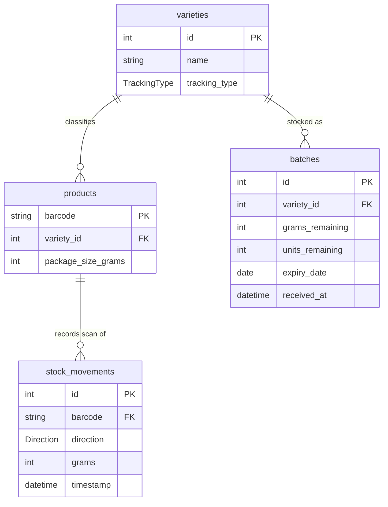

# Domain Concepts

The inventory system tracks stock across four SQLAlchemy entities defined in `models.py`: **Variety**, **Product**, **Batch**, and **StockMovement**. A variety declares how its stock is measured (by weight or by whole units); products are barcode-scannable items belonging to a variety; batches are delivery lots that carry expiry dates and remaining stock; and stock movements record every inventory change. The central business rule is a FIFO-by-expiry consumption invariant: stock is always taken from the earliest-expiring batch first, spilling over to later batches when the earliest is exhausted.

## Entity-relationship model

*Every entity and attribute above is grounded in `models.py`; `barcode` on `stock_movements` is nullable because manual deductions and batch restocks are not tied to a product.*

## Varieties

A **variety** (`Variety`) is the top-level inventory category. Its columns, from `models.py`:

- `id` — integer primary key.
- `name` — unique string name.
- `tracking_type` — `Enum(TrackingType)`, either `WEIGHT` or `UNITS`.

`tracking_type` is the key branch in the business logic. It determines both how the UI prompts for quantities and how the backend decrements stock. Every product and every batch belongs to exactly one variety, so the variety's `tracking_type` governs the whole deduction path for its products and batches.

## Products

A **product** (`Product`) is the barcode-scannable item sold at the counter. Its columns:

- `barcode` — string **primary key** (the barcode is the identity of the product).
- `variety_id` — `ForeignKey("varieties.id")`, linking the product to its variety and its tracking mode.
- `package_size_grams` — nullable integer; required for weight-tracked products because a scan consumes exactly this many grams.

Scanning is barcode-driven: the system looks up the product by `barcode`, resolves the associated `variety`, and uses `variety.tracking_type` to decide how stock is consumed (`scan_barcode` in `main.py`).

## Batches

A **batch** (`Batch`) is a delivery lot with its own expiry date. Its columns:

- `id` — integer primary key.
- `variety_id` — `ForeignKey("varieties.id")`.
- `grams_remaining` — nullable; used by weight-tracked varieties.
- `units_remaining` — nullable; used by unit-tracked varieties.
- `expiry_date` — `Date`, the value that drives FIFO ordering.
- `received_at` — `DateTime`, defaults to the current UTC time and is kept for audit/history.

Weight-tracked batches use `grams_remaining`; unit-tracked batches use `units_remaining`. Batches are **not** interchangeable across varieties — each batch is scoped to a `variety_id`, and stock consumption is computed per-variety.

## Stock movements

A **stock movement** (`StockMovement`) records an inventory change. Its columns:

- `id` — integer primary key.
- `barcode` — `ForeignKey("products.barcode")`, **nullable**; set for product scans, `None` for manual deductions and batch restocks.
- `direction` — `Enum(Direction)`, `IN` for restocks and `OUT` for scans and manual deductions.
- `grams` — integer; see the `grams` overload note below.
- `timestamp` — `DateTime`, defaults to current UTC time.

`IN` movements are created when a batch is added (`create_batch`); `OUT` movements are created by barcode scans (`scan_barcode`) and manual deductions (`manual_deduct`).

### The `grams` column overload

The `grams` column is **not** a weight-only field. It is overloaded to carry whichever quantity dimension the variety uses:

- For **weight-tracked** items it stores gram amounts.
- For **unit-tracked** items it stores **unit counts**.

This is established in `main.py`:

- `create_batch` writes `grams = new_batch.grams_remaining` for weight batches, but `grams = new_batch.units_remaining` for unit batches — i.e. the restock `IN` movement stores the unit count in `grams`.
- `scan_barcode` records a unit scan as `grams=1` (one unit) for `Direction.OUT`.

This coupling is relied on by `scripts/low_stock.py`, which sums `movement.grams` for `OUT` movements regardless of tracking type to estimate weekly consumption. Changing the semantics of the `grams` column would break that script's consumption calculation.

## Tracking modes

`TrackingType` (from `models.py`) has two members:

- `WEIGHT` (`"weight"`) — for bulk goods sold by weight (e.g. nuts, dried fruit). A scan/removal deducts a gram amount. A scanned product consumes its configured `package_size_grams`. The UI displays totals in grams.
- `UNITS` (`"units"`) — for packaged goods. A scan/removal deducts whole units (one per scan). The UI displays totals as units.

`Direction` (from `models.py`) has two members:

- `IN` (`"IN"`) — restocks, recorded by `create_batch`.
- `OUT` (`"OUT"`) — scans and manual deductions.

## FIFO / expiry semantics

FIFO is implemented as **"earliest expiry first,"** not "oldest inserted first." Stock is consumed from the batch with the earliest `expiry_date` first; if that batch cannot cover the full requested quantity, the remainder spills over to the next earliest batch, and so on.

This ordering is applied consistently in `main.py`:

- `scan_barcode` (weight path) and `manual_deduct` (weight path) query batches with `.order_by(Batch.expiry_date)`, then iterate, subtracting from each batch until the requested amount is exhausted.
- The unit paths (`scan_barcode` unit branch and `manual_deduct` unit branch) select the earliest-expiring batch with `units_remaining > 0` and decrement it.

This is the **central invariant** to preserve when changing the backend or the UI: batches must always be drained in `expiry_date` order. A scan that the on-file batches cannot fully cover is recorded as a `stock_mismatch` (the movement still logs the full requested/package amount, and the shortfall is returned for human follow-up).

## Pydantic validators

`ProductDeduct` and `BatchCreate` (in `schemas.py`) both enforce that at least one quantity field is supplied, using a Pydantic `model_validator(mode="after")`:

- `ProductDeduct.check_quantity` raises `ValueError("Πρέπει να δώσεις είτε grams είτε units")` when both `grams` and `units` are `None`. Note the Greek error message — `ProductDeduct` is the manual-deduction request body, so this validation surfaces to the API caller.
- `BatchCreate.check_quantity` raises `ValueError("Πρέπει να δώσεις είτε grams_remaining είτε units_remaining")` when both `grams_remaining` and `units_remaining` are `None`.

Both validators ensure the request specifies a quantity in the dimension appropriate to the variety's tracking mode.
